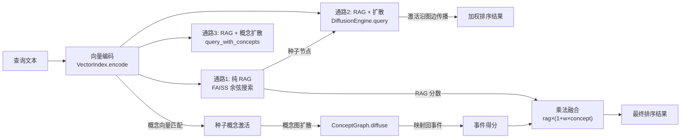

## 问题与范围

Memento 的检索（query）功能是如何实现的？探索范围覆盖从查询输入到结果输出的完整链路，包括三条检索通路及其协作方式。

## 速答

Memento 实现了**三条递进式检索通路**，模拟人脑"快速匹配 → 联想扩散 → 概念导航"的记忆检索过程：



**核心设计思想**：向量 RAG 提供语义"种子"，图扩散模拟人脑"一个记忆唤起另一个记忆"的联想能力，概念图则通过关键词锚点实现跨语义的"灵感跳跃"。三条通路按需选用，通路 3 是最终形态。

## 关键证据

### 证据 1：向量索引层 — FAISS 余弦搜索（通路 1 基础）

`memento/index/vector_index.py:457-479`

```python
def search(self, query_vector: np.ndarray, k: int = 10) -> List[Tuple[str, float]]:
    vec = query_vector.astype(np.float32).reshape(1, -1)
    norm = np.linalg.norm(vec)
    if norm > 0:
        vec = vec / norm
    scores, indices = self._index.search(vec, k)
```

支持四种嵌入后端（`vector_index.py:1-16`）：tfidf-svd、sentence-transformers、Qwen3-Embedding（0.6B/4B/8B）、远程 API。所有后端统一输出 L2 归一化向量，FAISS IndexFlatIP 做精确内积搜索。搜索后可选分数后处理（softmax / power / stretch），为下游扩散提供更有梯度的激活值。

**支撑结论**：通路 1 的纯 RAG 检索就是 `encode → FAISS search → 状态过滤` 三步，是其余两条通路的种子来源。

### 证据 2：激活扩散引擎 — 模拟联想记忆（通路 2 核心）

`memento/engine/diffusion.py:47-139`

DiffusionEngine.query 实现五步流程：

1. **种子获取**（L61）：`vector_index.search(query_vector, k=seed_k)` 取 top-20 语义最近节点
2. **种子激活**（L67-72）：`a_i = sim(q, v_i) × (1 + α·ω_i)`，重要性越高的种子初始激活越强
3. **多跳扩散**（L78-118）：能量沿图边传播 2 跳，每跳公式 `Δa_j = a_i × w_ij × β × (1 + γ·ω_i) × λ_i`，并附加逐跳衰减 `0.7^hop`
4. **过滤排序**（L121-134）：去除低于阈值 ε 的节点，最终得分 `score = a_j × (1 + δ·ω_j)`
5. **使用强化**（L137-163）：命中节点生命力 λ 提升、命中边权重 w 增强 — "被想起的记忆更容易再被想起"

**支撑结论**：通路 2 在 RAG 基础上通过图扩散实现了"联想"——一个被检索到的记忆会沿着经验边唤起相关记忆。

### 证据 3：概念图扩散 — 关键词锚点导航（通路 3 核心）

`memento/api.py:905-1025`，`memento/concept/concept_graph.py:292-394`

query_with_concepts 实现四阶段流程：

1. **双路种子**：同时做 RAG 节点检索（seed_k=20）和概念向量匹配（concept_k=8），概念激活 = `sim × initial_energy`
2. **概念扩散**（concept_graph.py:292-331）：能量在关键词副节点图上按边权归一分流传播，每跳衰减 0.7
3. **事件映射 + 查询感知路由**（concept_graph.py:333-394）：概念激活映射回事件得分，关键创新是**上下文门控** — 用查询向量与边上下文向量的余弦相似度控制能量流向，避免"父亲"概念同时激活小说和现实两个不相关事件
4. **乘法融合**（api.py:976-978）：`final = rag_score × (1 + concept_weight × concept_score)`，概念分只锦上添花不喧宾夺主

**支撑结论**：通路 3 通过关键词副节点图实现了"语义桥梁"——即使两段记忆在向量空间不相似，但共享关键词锚点就能被关联检索到。

### 证据 4：关键词提取 — 惊奇感锚点机制

`memento/index/keyatten_extractor.py`（由 `api.py:331` 延迟加载）

系统使用基于注意力权重的关键词提取器（MemoryKeywordExtractor），为每个记忆节点提取 5-8 个"惊奇关键词"。这些关键词是概念图的节点来源，也是建边的基础。

可选的惊奇度（surprisal）过滤：`1 - cos(关键词向量, 文本向量)` 衡量关键词对文本的"意外程度"。高惊奇度 = 独特锚点词（如"容器配置"），低惊奇度 = 主题内常见词（如"游戏"）。

**支撑结论**：关键词提取的质量直接决定概念图的连通性和检索精度。

### 证据 5：时间衰减 — 遗忘与保护并存

`memento/engine/decay.py:36-120`

DecayEngine 在每个时钟步对全系统施加衰减：

- 生命力 λ 自然衰减：`λ ← λ × (1 - rate × (1-ω))`，重要性越高的节点衰减越慢
- 边强度 w 衰减 + 弱边修剪（w < 0.01 的边被删除）
- 节点状态降级：λ 极低且 ω < 0.3 → cold（不参与检索），λ 低且 ω < 0.5 → dormant
- 高 ω 保护：当 ω ≥ 0.8 时，λ 有 0.3 的下限保护

**支撑结论**：衰减系统确保检索结果中"常用记忆"优先浮现，"久远记忆"自然淡出但不彻底消失。

## 细节展开

### 三条通路的 API 入口

| 通路 | API 方法 | 前置条件 | 适用场景 |
|------|---------|---------|---------|
| 纯 RAG | `query_rag_only()` | `build_index()` | 快速精确匹配、对比基线 |
| RAG + 图扩散 | `query()` | `build_index()` + 建边 | 关联记忆召回 |
| RAG + 概念扩散 | `query_with_concepts()` | `build_index()` + `build_concept_graph()` | 完整联想检索 |

### 图边的三种来源

| 边类型 | 建立方式 | 代码位置 |
|--------|---------|---------|
| cooccurrence | `activate()` 情境共现 | `api.py:242-263` |
| keyword | `build_keyword_edges()` 关键词重叠 | `api.py:266-499` |
| manual | `link()` 手动关联 | `api.py:1092-1095` |

### 概念图边权计算

概念-概念边权使用指数函数 `exponential_edge_weight()`（concept_graph.py:423-434），对余弦相似度做指数级区分：相似度低于阈值 → 0，高于阈值 → 指数增长。这确保只有真正语义相近的关键词之间才有强连接。

## 未决问题

- keyatten_extractor.py 的具体实现未在本次探索中深入阅读（只从调用方推断行为）
- sleep_engine.py 的融合机制对检索结果的长期影响未评估
- 各超参数（α/β/γ/δ/concept_weight 等）的调优经验和推荐值未记录

## 后续建议

可以基于这份探索去做参数调优实验的设计，或者深入 explore keyatten_extractor 的注意力权重提取机制。

## 相关文档

暂无（首次探索）。
