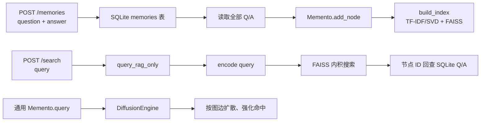

## 问题与范围

当前项目的记忆写入、索引、查询与持久化是怎样协作的？范围覆盖对外本地 Q/A 服务和通用 `Memento` 内核。

## 速答

项目分两层：对外的本地服务将一条 Q/A 落进 SQLite；内存中的 `Memento` 把 Q/A 转成向量节点并建立 FAISS 索引。对外服务每次写入后从 SQLite 全量重建轻量 TF-IDF 索引，以保证新增词马上可被查询。查询时它有意走纯 RAG，不启用图扩散；通用 `Memento.query()` 才会在向量召回后沿节点图传播激活值。

## 关键证据

1. `memento/local_service.py:40-63` 仅暴露 `/health`、`/memories`、`/search`；写入和查询交给同一个 `LocalMemoryService`。
2. `memento/local_memory.py:26-79` 的 `SQLiteMemoryRepository` 用单表保存 `id/question/answer/created_at`，每次数据库操作短连接并显式关闭。
3. `memento/local_memory.py:92-115` 的 `_rebuild_index()` 读取全量记录，将 Q/A 格式化为节点文本并调用 `Memento.build_index()`；因此本地服务不持久化向量索引，而是在进程启动和写入后恢复它。
4. `memento/local_memory.py:123-137` 调用 `query_rag_only()`，将返回节点 ID 映射回原始 Q/A；没有为该精简服务自动建图或运行扩散。
5. `memento/api.py:209-250` 将 `add_node()` 暂存的节点批量编码、加入 `VectorIndex` 和 `MemoryGraph`；首次构建调用 `fit_and_add()`，后续构建仅追加 pending 节点。
6. `memento/index/vector_index.py:381-410,496-523` 统一嵌入后端，默认 TF-IDF/SVD 生成归一化向量，以 `faiss.IndexFlatIP` 做精确内积搜索；归一化后内积等价于余弦相似度。
7. `memento/api.py:1151-1174` 的 `query()` 将查询向量交给 `DiffusionEngine`；`memento/engine/diffusion.py:61-159` 先取 RAG 种子，再按边权、重要性和生命力多跳传播，最后强化命中节点与边。

## 结论边界

- 当前本地 Q/A 服务的“记忆”是持久化 Q/A + 语义检索，不是完整的图联想模式；这是为了让 API 保持只有写入和查询两个动作。
- 通用 `Memento` 支持图扩散、关键词边与概念图；使用方需显式构建相应图结构后才会得到这些增强检索行为。
- 本地服务的全量重建保证正确性与即时可检索性，但写入成本随记录数线性增长，适用单进程、小规模本地库。
