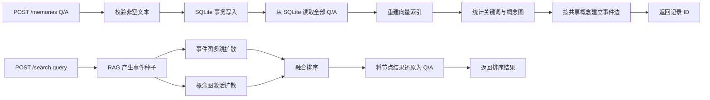

# Local memory service design

## 0. 目标

面向希望直接调用记忆能力的本地应用，提供一个零配置的 HTTP 服务：写入一条问答，随后按自然语言查询已保存的问答。调用方不需要了解节点、索引、图、睡眠或模型缓存。

假设：用户所说的“一段 Q/A”是两个文本字段 `question` 与 `answer`；查询传入一个文本字段 `query`。服务只监听本机地址。

## 1. 决策与边界

### 决策

- 新建精简服务，保留现有 `memento.server` 的完整专家 API，不修改其行为。
- 公开 API 固定为 `POST /memories`、`POST /search` 和 `GET /health`。
- 使用 Python 标准库 SQLite 保存到单一数据库文件，默认 `data/memento.db`。
- 使用 `tfidf-svd` 作为默认嵌入后端，因此首次运行不下载模型、不要求 API Key。
- 每次成功写入后，在进程内从 SQLite 全量重建 Memento 索引、统计关键词事件边和概念图；这样写入后可立即参与完整联想查询。
- 查询内部融合三路信号：向量相关性、事件节点图扩散、概念副节点图扩散；调用方仍只需要提交一段查询文本。

### 明确不做

- 不提供删除、修改、批量导入、图配置或远程多用户鉴权。
- 不启用依赖本地大模型或远程 LLM 的 KeyAtten、LLM surprisal、睡眠策展与融合；默认服务只迁移无需外部模型的在线图联想路径。
- 不把向量、FAISS 索引或模型缓存写入 SQLite；服务重启时由原始 Q/A 重建索引。
- 不监听 `0.0.0.0`，不把它定位为公网服务。

### 复杂度档位

走默认本地单进程档位。写入期间以进程内锁串行化重建与查询，避免内存索引和数据库快照不一致。

## 2. 名词与编排

### 2.1 名词层

**现状**：`Memento.add_node()` 接收任意文本；`memento.store` 将节点、FAISS 索引和元数据拆分为多个文件；`memento.server` 暴露底层编排接口。

**变化**：新增面向调用者的 Q/A 记录和三个简化契约。

| 契约 | 输入 | 输出 |
| --- | --- | --- |
| 写入 | `{ "question": "如何备份？", "answer": "使用定期快照。" }` | `{ "id": "…", "created_at": "…" }` |
| 查询 | `{ "query": "备份怎么做？", "limit": 5 }` | `{ "results": [{ "id": "…", "question": "…", "answer": "…", "score": 0.82 }] }` |
| 健康检查 | 无 | `{ "status": "ok", "memory_count": 12 }` |

SQLite 表 `memories` 保存 `id`、`question`、`answer`、`created_at`。Memento 的内部节点文本由固定模板 `用户问: {question}\n回答: {answer}` 生成，节点 ID 与数据库 ID 一致。

### 2.2 编排层

**现状**：调用者需要自行 `add_node()`、`build_index()`、`save()`；通用 HTTP 服务要求调用者理解这些步骤。

**变化**：精简服务在启动、写入和查询时接管这些编排。

- 启动：初始化数据库表，读取已有 Q/A，构建内存索引；空库可正常启动，查询返回空结果。
- 写入：先提交 SQLite，再重建内存索引；若重建失败，返回服务器错误，记录仍保留，重启后会重试构建。
- 建图：`build_index()` 后调用统计关键词版 `build_concept_graph(keyword_method="statistical")`；再复用已提取关键词，依据事件的共享关键词建立 `keyword` 事件边。该路径不下载模型、不要求 API Key。
- 查询：若库为空返回空数组；否则调用完整联想查询，融合 `DiffusionEngine` 的事件图扩散结果与 `query_with_concepts()` 的概念支持结果。结果保留总分，并提供 RAG、事件图和概念图分量，便于验证联想来源。
- 并发：写入与查询共用服务锁。SQLite 每次操作使用短生命周期连接，避免跨线程复用连接。

### 2.3 挂载点

- `memento.local_service`：服务启动入口与 HTTP 路由；删除后精简 HTTP 产品入口消失。
- SQLite repository：唯一的 Q/A 持久化边界；删除后服务无法跨重启保存记忆。
- 内存索引重建器：连接 SQLite 记录和现有 `Memento` 检索内核；删除后写入结果无法查询。
- README 快速开始：面向开源使用者的可执行接入说明；删除后该能力无法被发现和复现。

### 2.4 推进策略

1. 建立 SQLite Q/A repository 和索引重建编排，退出信号是重启后仍可查询先前写入。
2. 建立最小 HTTP 路由与请求校验，退出信号是写入、查询、空库与非法参数有稳定 JSON 响应。
3. 更新开源说明与可复制命令，退出信号是新环境仅安装服务依赖即可完成写入→查询。
4. 将真实评测数据取消跟踪并忽略，退出信号是 `data/testtxt.txt` 保留本地但不再出现在待提交文件中。

### 2.5 结构健康度与微重构

现有 `memento/server.py` 已承载完整专家 API，继续向其中塞入“简化产品 API”会混合两套对外职责；本次不在其中增量堆叠，而是新建独立模块。`memento/` 目录按职责划分健康，无需目录重组。除新增文件和文档外，本次不做微重构。

## 3. 验收契约

| 场景 | 输入 / 触发 | 可观察结果 |
| --- | --- | --- |
| 首次启动 | 空数据库文件路径 | 服务启动成功，`GET /health` 返回 `memory_count: 0`。 |
| 写入并查询 | 写入一条 Q/A 后，以语义相近问题查询 | 结果包含该 Q/A、稳定 ID 与数值分数。 |
| 跨重启 | 写入后停止并重启同一数据库路径 | 查询仍返回先前 Q/A。 |
| 多条排序 | 写入至少三条不同主题 Q/A 后查询 | `limit` 内返回按相关性排序的结果。 |
| 事件图联想 | 两条 Q/A 共享有效概念但文字表述不同 | 内存事件图存在 `keyword` 边，查询结果含非零事件图分量。 |
| 概念图联想 | 查询命中某一概念及其相邻概念 | 查询结果含概念分量，概念图中存在事件-概念边与概念-概念边。 |
| 完整重建 | 使用同一数据库重启服务 | 向量索引、事件边和概念图均从 SQLite 原始 Q/A 自动恢复。 |
| 请求校验 | 空 question、空 answer、空 query 或不合法 limit | 返回 422，不写入数据库。 |
| 边界 | 空库查询 | 返回 `results: []`，不报 500。 |
| 反向核对 | 检查服务路由与 README | 不存在删除/编辑/批量导入/概念图等精简服务接口。 |

## 4. 发布与卸载

运行方式固定为 `python -m memento.local_service --db data/memento.db`。README 给出 `curl` 和 PowerShell 示例，并说明该数据库属于本地状态、不得提交。

卸载该功能时，移除精简服务模块、其测试和 README 小节即可；现有 `Memento`、CLI、MCP、通用 HTTP 服务与聊天 demo 均不依赖它。用户自己的 `memento.db` 不由卸载流程删除。

## 确认记录

2026-07-30：用户确认采用单文件 SQLite，并确认精简服务只保留写入、查询和健康检查接口。

2026-07-31：用户明确要求内部不能停留在纯 RAG，需迁移事件图联想与概念图能力；外部精简接口保持不变。
